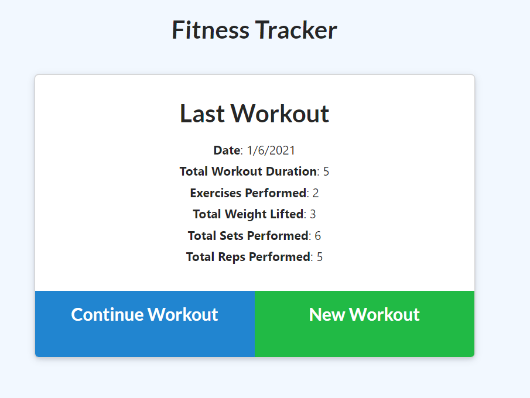
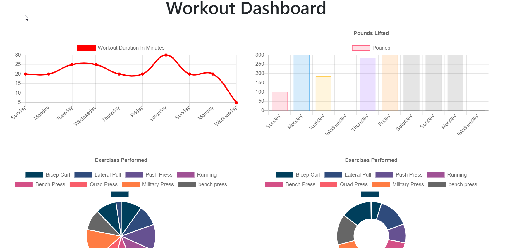

## FITNESS TRACKER

## Description 
  This is a fitness tracker that allows user to track their progress for each workout and cumulative workouts, with the premise that the consumer will reach their fitness goals more quickly when they track their workout progress.

## Tech 
  * npm
  * express
  * mongoose
  * mongodb
  * heroku
  * github

## Installation
  Run npm i to add the dependencies, run mongod

## Usage 
   For anyone who wants to lose weight, keep in shape, of just to maintain a healty weight - you choose!     

## License
  MIT
## Contributing
  Anyone is free to contribute to make this project better.

## Tests
  I ensured that the MongoDB was running smoothly locally and with Heroku

  # Name
  Alisa Macedo

## Questions/Contact
  alisaamacedo@gmail.com
  LisaAAAlisa
        

